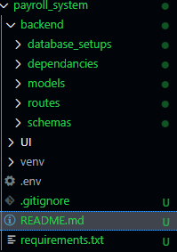

This project is a payroll management system that allows users of an enterprise to:
1 --> Register as employees
2 --> View their payrolls
3 --> Print their payrolls

## --PROJECT FEATURES--

## ---PROJECT STRUCTURE---

## ---INSTALLATION AND SETUP---
## --Clone the repository--
    >>bash
    $git clone https://github.com/peter-289/payroll_system
    $cd backend
## --Create a python virtual enviroment--
python -m venv venv
venv\Scripts\activate  # (Windows)
source venv/bin/activate  # (Mac/Linux)
## --Install requirements--
pip install -r requirements.txt

## --Run the backend server--
 uvicorn main:app --reload
